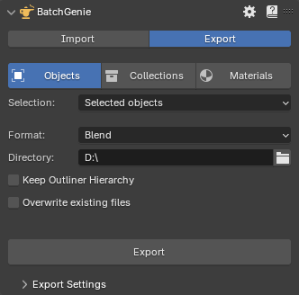

# Exporting [BETA]

{ .img-box align=right }

!!! info2 "Info"
    The exporting functionality, released in version **1.0.6**, is still under development, and the current functions are quite basic. In the upcoming updates, the export functionality will be expanded and will also be available in the Asset Browser for easy exporting of your assets in various formats.

To find the current exporting tools, navigate to the main `BatchGenie panel` in the 3D Viewport and click on  `export`.

=== "Objects"
    - **Selection**: Allows you to specify which objects to include in Export:
        - **Selected objects**: Choose the currently selected object(s) in your scene.
        - **Objects marked as Assets**: Objects in the your file that are marked as Assets.
        - **Objects NOT marked as Assets**: Objects in the your file that are NOT marked as Assets.
        - **All objects**: All objects in the your file regardless if they are marked as Assets or not.

=== "Collections"
    - **Selection**: Allows you to specify which collections to include in Export:
        - **Selected collection**: Choose the currently selected object(s) in your scene.
        - **Collections marked as Assets**: Collections in the your file that are marked as Assets.
        - **Collections NOT marked as Assets**: Collections in the your file that are NOT marked as Assets.
        - **All collections**: All objects in the your file regardless if they are marked as Assets or not.

=== "Materials"
    - **Selection**: Allows you to specify which materials to include in Export:
        - **Materials on Selected Objects**: All materials assigned to the currently selected object(s) in your scene.
        - **Materials marked as Assets**: Materials in the your file that are marked as Assets.
        - **Materials NOT marked as Assets**: Materials in the your file that are NOT marked as Assets.
        - **All materials**: All materials in the your file regardless if they are marked as Assets or not.

- **Format**: Currently only **.Blend** files are supported.
- **Directory**: Choose a directory to export to. The exported files will be named after the object names.
- **Keep Outliner Hierarchy** (Objects only): When enabled, this option ensures that the exported objects follow the structure seen in Blender’s Outliner. Directories are created to match the hierarchy of objects, placing them in subfolders based on their relationships within the Outliner. Collections without any objects are excluded from this process to keep the structure clean. This is useful for maintaining the organization of complex object setups during export.
- **Overwrite existing files**: Enable this to overwrite existing files with the same name in the selected folder.

### Settings

- **Use Fake user for Materials**: Use Fake User on exported materials. This prevents them from being automatically removed when the exported file is saved. *Note: This cannot be disabled.*
- **Asset status**:
    - **Keep current**: Keeps current Asset status.
    - **Mark as Asset**: Marks the Exported objects as Assets, making them easily accessible in Blender's Asset Browser for future use.
    - **Clear Asset**: Clears the Asset mark.
- **Add Metadata**:
    - **Description**
    - **License**
    - **Copyright**
    - **Author**