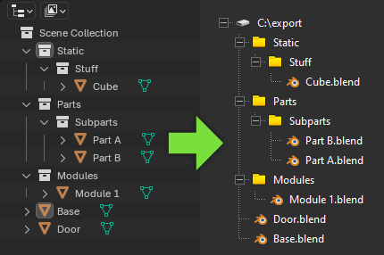
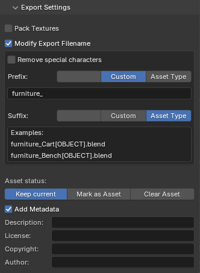
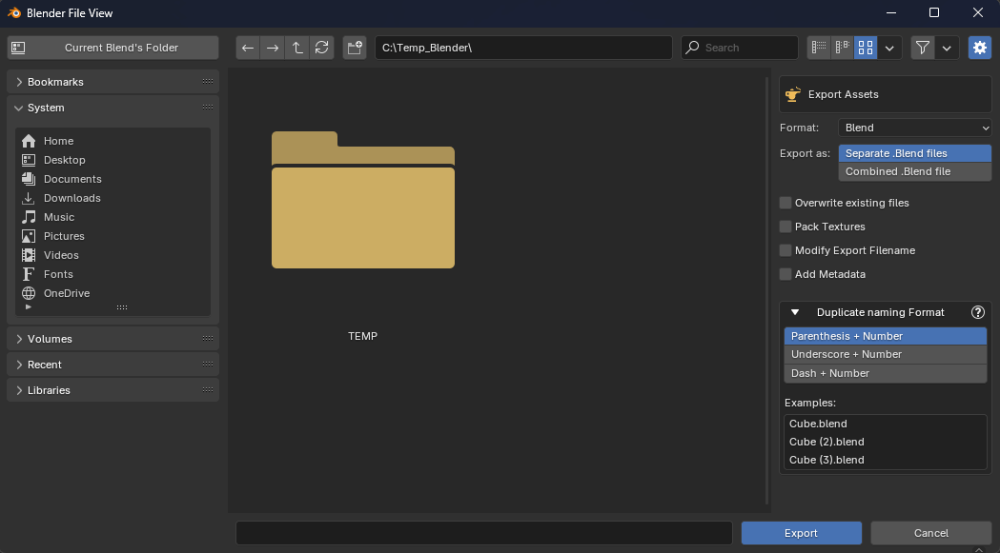

# Exporting

To find the exporting tools, you can either:

- Navigate to the main `BatchGenie panel` in the `3D Viewport` and click on Export.
- Alternatively, if you're exporting via the Asset Browser, go to `BatchGenie > Misc > Export` inside the Asset Browser.

{ .img-box align=right }

=== "Objects"
    - **Selection**: Allows you to specify which objects to include in Export:
        - **Selected objects**: Choose the currently selected object(s) in your scene.
        - **Objects marked as Assets**: Objects in the your file that are marked as Assets.
        - **Objects NOT marked as Assets**: Objects in the your file that are NOT marked as Assets.
        - **All objects**: All objects in the your file regardless if they are marked as Assets or not.

=== "Collections"
    - **Selection**: Allows you to specify which collections to include in Export:
        - **Selected collection**: Choose the currently selected collection in your scene.
        - **Collections marked as Assets**: Collections in the your file that are marked as Assets.
        - **Collections NOT marked as Assets**: Collections in the your file that are NOT marked as Assets.
        - **All collections**: All objects in the your file regardless if they are marked as Assets or not.

=== "Materials"
    - **Selection**: Allows you to specify which materials to include in Export:
        - **Materials on Selected Objects**: All materials assigned to the currently selected object(s) in your scene.
        - **Materials marked as Assets**: Materials in the your file that are marked as Assets.
        - **Materials NOT marked as Assets**: Materials in the your file that are NOT marked as Assets.
        - **All materials**: All materials in the your file regardless if they are marked as Assets or not.

{ .img-box align=right }

- **Format**: Currently only **.Blend** files are supported.
- **Directory**: Choose a directory to export to. The exported files will be named after the object names.
- **Keep Outliner Hierarchy** (Objects only): When enabled, this option ensures that the exported objects follow the structure seen in Blender’s Outliner. Directories are created to match the hierarchy of objects, placing them in subfolders based on their relationships within the Outliner. Collections without any objects are excluded from this process to keep the structure clean.

- **Overwrite existing files**: Enable this to overwrite existing files with the same name in the selected folder.

### Settings

{ .img-box align=left }

- **Pack Textures**: Pack all associated textures into their respective blend files, ensuring that your assets maintain their appearance without relying on external texture files
- **Modify Export Filename**: Customize the file names by adding a prefix (characters added before the name) and/or a suffix (characters added after the name). These can be defined in two ways:
    - **Custom**: Allows you to enter any custom characters of your choice.
    - **Asset Type**: Automatically appends the asset type (e.g., Object, Material, Collection) to the name for easier identification.
- **Asset status**:
    - **Keep current**: Keeps current Asset status.
    - **Mark as Asset**: Marks the Exported objects as Assets, making them easily accessible in Blender's Asset Browser for future use.
    - **Clear Asset**: Clears the Asset mark.
- **Add Metadata**: Description, License, Copyright & Author

!!! info2  "Materials Use Fake User"
    Materials will have 'use fake user' activated if they are not marked as assets to prevent them from being automatically removed when the exported file is saved.

### Via Asset Browser

If you're exporting via the Asset Browser, you'll be presented with similar settings as in the main panel. Note the panel on the right side with the settings:

{ .img-box }