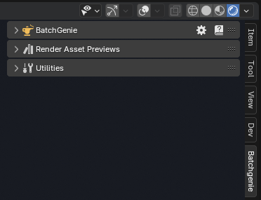

To get started, you have two options: Watch the introductory video guide below for a step-by-step walkthrough of the basics, or follow the written documentation on this site.

### Video Introduction

>
- 00:00 Introduction
- 02:00 Importing Textures
- 10:00 Rendering Previews
- 15:00 Utilities

### Installation

BatchGenie has been verified to work with Blender 4.2 LTS on Windows.

To start using BatchGenie, you need to install the add-on in Blender. Follow these steps:

1. Download the BatchGenie add-on zip file from the store you purchased it from.
2. Open Blender and go to `Edit > Preferences`.
3. In the Preferences window, navigate to the `Add-ons` tab.
4. Locate the `Add-ons Settings` (:octicons-chevron-down-12: icon) in the top right corner.
4. Click on `Install from Disk` and select the downloaded BatchGenie zip file.
5. Once installed, enable the add-on by checking the box next to BatchGenie in the add-on list. **[WIP]**

!!! info2 "Updates"
    BatchGenie respects your privacy. It operates offline and does not collect any data. Therefore, there is no auto-update functionality within the add-on. For updates, simply download the updated add-on manually from the store where you purchased it, uninstall the old version and reinstall the new using the same steps outlined in the instructions above.

### Finding BatchGenie and Using the Documentation

BatchGenie is located in the N-Panel inside the `3D Viewport` under a tab named `BatchGenie`, as shown in the image below. Alternatively, you can place it under the `Tool` tab by changing this setting in the Preferences.

{ .img-box align=left }

All features include hover-over tooltips for quick details within the add-on. Some areas also have an extra :material-information-box: information icon, which opens a popup with additional information and a link to the relevant section of the documentation for further instructions. For more comprehensive guidance, you can access the full documentation by clicking the :blender_icon_help:icon in the BatchGenie main panel.