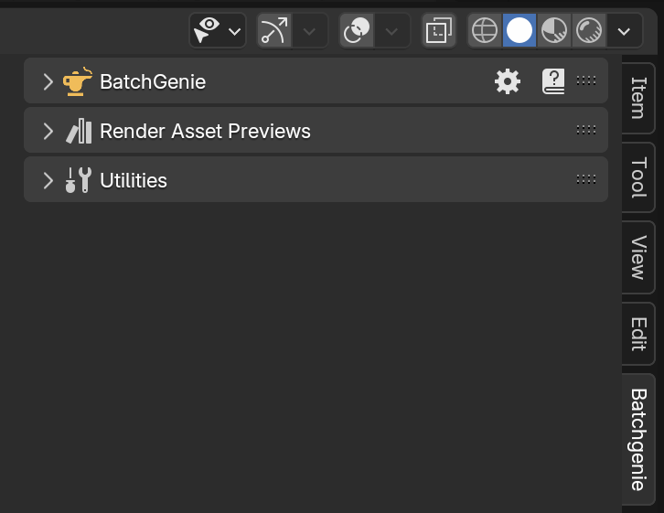

To get started, you have two options: Watch the introductory video guide below for a step-by-step walkthrough of the basics, or follow the written documentation on this site.

### Video Introduction

    <iframe id="videoPlayer" width="560" height="315" src="https://www.youtube.com/embed/yMMH5RZoKMk?rel=0" frameborder="0" allowfullscreen></iframe>

??? info2 "Video Timestamps"
    

    - [00:00 Intro](javascript:void(0))
    - [00:21 Basics](javascript:void(0))
    - [01:29 Importing Textures](javascript:void(0))
    - [02:16 Import Settings](javascript:void(0))
    - [04:13 Import Settings - Replace Principled BSDF](javascript:void(0))
    - [06:12 Import Settings - Custom Attributes](javascript:void(0))
    - [08:09 Import Settings - Custom Texture](javascript:void(0))
    - [09:17 Import Preferences](javascript:void(0))
    - [10:13 Rendering Asset Previews](javascript:void(0))
    - [11:06 Rendering via the panel](javascript:void(0))
    - [12:25 Render Settings](javascript:void(0))
    - [15:25 Rendering via the Panel (part 2)](javascript:void(0))
    - [16:33 Render Settings - Studio Presets](javascript:void(0))
    - [17:49 Render Settings - Camera Override](javascript:void(0))
    - [20:49 Rendering via the Asset Browser](javascript:void(0))
    - [22:38 Utilities](javascript:void(0))
    - [22:57 Utilities - Locating the Utilities](javascript:void(0))
    - [23:36 Utilities - Quick Tips](javascript:void(0))
    - [24:01 Utility - Change Node Attributes](javascript:void(0))
    - [27:56 Utility - Change Material Settings](javascript:void(0))
    - [29:02 Utility - Replace Shader Nodes](javascript:void(0))
    - [31:10 Utility - Find Unconnected Nodes](javascript:void(0))
    - [34:47 Utility - Find Zero Strength Nodes](javascript:void(0))
    - [36:40 Utility - Color Space Validator](javascript:void(0))
    - [38:40 Utility - Batch Rename](javascript:void(0))
    - [40:37 Utility - Reload Images](javascript:void(0))
    - [41:01 Utility - Clean File](javascript:void(0))
    - [41:48 Shader Editor Utilities](javascript:void(0))
    - [42:01 Utility - Replace Node](javascript:void(0))
    - [43:34 Utility - Find Zero Strength Nodes (Shader Editor)](javascript:void(0))
    - [44:37 Asset Browser Utilities](javascript:void(0))
    - [45:05 Utility - Add Asset Tags](javascript:void(0))
    - [49:38 Utility - Combine & Split Asset Tags](javascript:void(0))
    - [50:52 Utility - Remove Asset Tags](javascript:void(0))
    - [52:52 Utility - Asset Metadata](javascript:void(0))
    - [54:03 Utility - Move Assets](javascript:void(0))
    - [55:37 Preferences](javascript:void(0))
    - [57:12 Wrap-Up](javascript:void(0))
    - [57:38 END](javascript:void(0))

    

### Installation

To start using BatchGenie, you need to install the add-on in Blender. Follow these steps:

1. Download the BatchGenie add-on zip file from the store you purchased it from.
2. Open Blender and go to `Edit > Preferences`.
3. In the Preferences window, navigate to the `Add-ons` tab.
4. Locate the `Add-ons Settings` (:octicons-chevron-down-12: icon) in the top right corner.
5. Click on `Install from Disk` and select the downloaded BatchGenie zip file.

!!! info2 "Updates"
    BatchGenie respects your privacy. It operates offline and does not collect any data. Therefore, there is no auto-update functionality within the add-on. For updates, simply download the updated add-on manually from the store where you purchased it, uninstall the old version and reinstall the new using the same steps outlined in the instructions above.

### Finding BatchGenie and Using the Documentation

BatchGenie is located in the N-Panel inside the `3D Viewport` under a tab named `BatchGenie`, as shown in the image below. Alternatively, you can place it under the `Tool` tab by changing this setting in the Preferences.

{ .img-box align=left width=36% }

Every feature includes hover-over tooltips, providing quick and detailed explanations directly within the add-on interface, making it easy to understand functionality without needing to leave the workspace. Some areas also have an extra :octicons-question-24: icon, which opens a popup with additional information and a link to the relevant section of the documentation for further instructions.

For more comprehensive guidance, you can access the full documentation by clicking the :blender_icon_help:icon in the BatchGenie main panel.