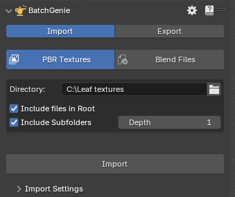
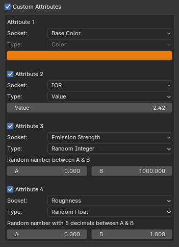
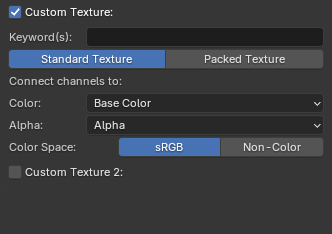
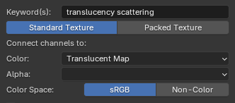
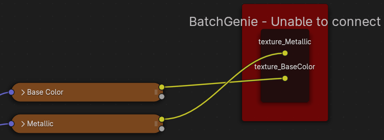

{ .img-box align=right }

1. Open the main BatchGenie panel.
2. Go to the `Batch Import PBR Texture` section.
3. Select the folder containing your textures.
4. If you need to make any adjustments, click on the `Import Settings` tab. Otherwise, proceed to the next step.
5. Click on `Import`, and BatchGenie will automatically import and set up the textures for you.

<figure markdown="span">
  { .on-glb width=60% .img-box data-title="Example of an import with various additional accessory nodes." data-description="These nodes are automatically added by BatchGenie when needed, such as converting normals and performing other necessary adjustments."}
  <figcaption>Example of an import with various additional accessory nodes.</figcaption>
</figure>

---

### Import Settings

{ .img-box align=left }

#### General Settings

- **Include files in root**: Import textures located directly in the root of the selected folder.
- **Include Subfolders**: Import textures from subfolders within the selected folder. By default, BatchGenie only searches for subfolders one level deep, but this depth can be adjusted in the Preferences.
- **Skip existing**: Do not import materials if a material with the same name already exists.
- **Use Fake User**: Use Fake User on imported materials. Ensures that imported materials are saved with your project, even if they're not currently in use. This prevents them from being automatically removed when you save your file.
- **Mark as Asset**: Marks imported materials as Assets, making them easily accessible in Blender's Asset Browser for future use.

- **Alpha from Base Color**: Use the Alpha channel from the 'Base Color' texture and ignore separate Alpha textures. Options include:
    - **No**
    - **Auto**: Tries to automatically detect the presence of data in the alpha channel, but with a significant processing time impact. See the info box below for details.
    - **Force On**: Does not check for the presence of an alpha channel but connects it regardless.

    ??? info2 "Autodetect Alpha"
        With the '**Auto**' setting, BatchGenie will check the 'Base Color' texture and try to detect data in its Alpha channel. Since there is no built-in function in Blender to do this, BatchGenie examines the pixels in the alpha channel (present in images that support it, even if empty) to see if there is usable data. While this process is effective, it significantly increases processing time.

        With the '**Force On**' setting, no extra processing is done since the alpha socket will be connected regardless. This is the best option if you know your textures use alpha from the albedo texture.

        !!! warning "Extra Processing Time"
            Extra processing time per material depending on texture resolution:

            - 2K: 0.4~sec
            - 4K: 1~sec.
            - 8K: 4~sec.
            - 16K: 20~sec.

            Benchmark performed with PNG files on an Intel i7-14700K CPU. While this additional time might seem minor, it becomes significant when compared to the setting being disabled. For example, without this setting enabled, importing a folder with 183 different 4K and 8K texture sets, totaling 725 images and weighing 50GB, takes only 3.5 seconds.

- **DirectX Normals**: If your materials use DirectX normals but this isn't indicated in their filenames(and the add-on's DirectX detection isn't recognizing them), enable this option to add a 'DirectX to OpenGL' node for normal conversion. See [Preferences](preferences.md#advanced) to adjust this function.
- **Filter**: Filter out unwanted textures. Example usage would be to filter out DirectX normal maps by using the filter 'DirectX' or 'DX'.

---

#### Material Settings

{ .img-box align=left }

- **Displacement**: Sets the displacement setting of the imported materials. Choose 'Bump Only' for surface texture simulation, 'Displacement' for actual geometric displacement, or 'Displacement & Bump' for a combination of both effects.

 - Eevee Specific Settings: These settings reflect Blender's defaults Eevee specific settings, such as: Transparent Shadows, Render Method, Raytraced Transmission.

    For further technical details see [this section](https://docs.blender.org/manual/en/4.2/render/eevee/material_settings.html){ target="_blank" } in the blender manual.

<!-- - **Blend Mode**: Controls how the material interacts with lighting and transparency, offering options for different blending effects.
- **Shadow Mode**: Determines how shadows are cast and rendered for the object, providing control over shadow interaction.
- **Raytrace Refraction**: Controls how refraction is handled for the material.
- **Subsurface Translucency**: Controls the appearance of light passing through the surface, simulating translucent materials such as skin or wax. -->

#### Image Texture Node Settings

{ .img-box align=left }

- **Mapping**: The dropdown menu allows you to select the texture mapping method for the textures. Options include UV, Object, and None. Upon selection, the add-on automatically adds the corresponding Texture Coordinate and Mapping nodes to the material.

- **Texture Interpolation**: Adjust the interpolation method for image texture nodes. This setting controls how textures are sampled and smoothed. Options include Blender's default options. There are two selections: the '**default**' option, applied to all textures except displacement, and a separate setting specifically for displacement textures.

- **Projection**: The 'Projection' option allows you to choose and adjust the texture projection method for the material. Options include Blender's default methods. For 'Box' projection, there will also be a 'Blend' amount slider available.

- **Texture Extension**: Defines how the image is extrapolated past its original bounds. Options include Blender's default methods.

*For further technical details about texture Interpolation, Projection & Extension see the [this section](https://docs.blender.org/manual/en/latest/render/shader_nodes/textures/image.html){ target="_blank" } in the Blender manual.*

---

#### Replace Principled BSDF

Use a custom Node-Group instead of a Principled BSDF for the imported materials. Easily pick from a dropdown that shows all Node-Groups in the current blend file.

{ .img-box align=left }

BatchGenie searches for keywords to match and connect the sockets in the new Node-Group, treating them as if they were part of a regular shader.

!!! info2 "Tip"
    It also detects if the Node-Group has a socket named 'Normal Color' and connects the Normal Map texture directly, bypassing the Normal Map Node.

---

#### Custom Attributes

{ .img-box align=right }
Set one or multiple socket attributes such as color or values during import.

BatchGenie automatically finds the sockets of the Principled BSDF (or from your chosen custom Node-Group) and shows what type of values you can set.
For example, you could set the IOR value for each imported material to a specific value, or use the random-number function to populate a seed number socket. You can set up to 4 attributes during import, and if you need more, you can use the [Change Node Attributes](utilities.md#change-node-attributes) utility afterward.

**Attribute Types**:

- **Color**: Set a specific color.
- **Value**: Set a specific value.
- **Random Integer**: Set a randomly generated number as the value.
- **Random Float**: Set a randomly generated number with 5 decimals as the value. Example: 3.14159

*For both Random Integer and Random Float, you can specify the range for the randomly generated values.*

---

#### Texture Type Settings

Here you can choose which texture types to import. Usually, having everything enabled works great, and the add-on has logic to avoid importing duplicates of similar maps. The following texture types also have strength adjustment settings that you can configure during import: Normal, Bump, Ambient Occlusion, Cavity & Displacement.

!!! info2 ""
    - If both Roughness and Gloss textures are found, the gloss will be ignored.
    - If a packed texture is found, it takes priority over separate maps. For example, if a packed ARM texture (AO/Roughness/Metallic) is found alongside separate AO, Roughness, and Metallic textures, the ARM texture will be kept and the separate textures will be ignored.

    - The Ambient Occlusion & Cavity maps will be connected to a 'Mix Color' node alongside the diffuse map. The 'Mix Color' node is set to multiply, controlling the strength of the effect. If both types of maps are found, they will be connected in series.

<h5>Custom Texture</h5>

The last texture option is **Custom** which makes it possible to import any custom type of map.

{ .img-box align=left }

- **Keyword(s)**: Enter one or more keywords separated by spaces to search and identify your custom textures during the import process. Case-insensitive.
- **Texture Type**:
    - **Standard**: Connects the texture using the conventional method, linking the color output to your chosen socket.
    - **Packed**: Used for textures where multiple maps are combined into one file. This option separates the texture into individual R, G, B, and A channels, connecting each to different sockets. Most packed maps use RGB channels, but some utilize all four.

- **Connect to**:
    - For **Standard** textures, choose from a dropdown featuring sockets in the Principled BSDF shader. If a custom Node-Group is selected in previous settings, the dropdown will display sockets from that group instead.
    - For **Packed** textures, four dropdowns appear for the R, G, B, and A channels, allowing you to assign each channel to different sockets.
- **Color Space**: The Color Space of the image, either 'Color' for images with color or 'Non-Color' for everything else.

!!! abstract "Custom Texture Example"
    { .img-box align=left }

    So in this example BatchGenie will look for any images that contain the words 'Translucency' or 'Scattering' and connect them to a socket named 'Translucent Map' from a custom Node-Group.

## FAQ

- **How should the texture folder structure look?**
    - Supports a mix of subfolders and files, allowing processing of textures located in both the root folder and subfolders. While the root folder can contain any number of textures mixed together, subfolders should be used to organize distinct sets of textures.

- **What if there is an issue finding the appropriate connection for a texture?**
    - If this occurs, BatchGenie will create a frame with reroute node points for all unconnected textures within the material. From here, you can easily reconnect or delete the textures as needed. This scenario may occur, for example, when utilizing custom Node-Groups instead of the Principled BSDF, and the custom Node-Group lacks certain socket inputs for the textures discovered.

        The [Find Unconnected Nodes](utilities.md#find-unconnected-nodes) utility can assist you to find these issues.

        ??? abstract "Unconnected Textures Example"
            In the the example below you can see a scenario where BatchGenie has not been able to connect the 'Base Color' & 'Metallic' textures and has created some extra info nodes.
            You can use the [Clean File](utilities.md#clean-file) utility to batch remove these from all your materials if needed.

            { .img-box }

- **How are DirectX & OpenGL normal maps handled?**
    - BatchGenie attempts to identify the type of normal map by examining the texture names, which you can configure in the [Preferences](preferences.md#advanced-import-settings). If your normal maps do not indicate their format, I highly recommend [this guide](https://www.texturecan.com/post/3/DirectX-vs-OpenGL-Normal-Map/){ target="_blank" } over at **texturecan.com** for help in identifying your maps.

- **What image formats are supported?**
    - Currently supported formats include `bmp, png, jpg, jpeg, tga, exr, tif, tiff, webp`. Blender supports additional exotic formats, which you can find [here](https://docs.blender.org/manual/en/latest/files/media/image_formats.html){ target="_blank" }. These should work as well, but they are currently filtered out because I have been unable to test them since they are very uncommon formats. If you need support for these formats, please let me know.

## More adjustments in Preferences {#more-settings data-search-exclude}
See the add-on [Preferences](preferences.md) for more settings related to importing.