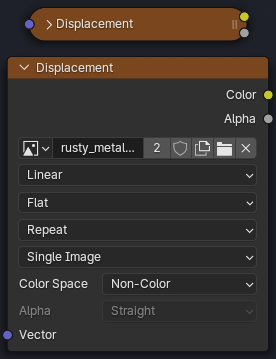
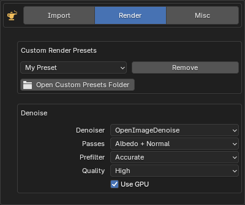

To access BatchGenie's Preferences, click on the :blender_icon_preferences:icon in the BatchGenie panel. Alternatively, you can go to  `Edit > Preferences `, find BatchGenie listed under the Add-ons tab, and click to access its settings for customization.

<br>

{ .img-box align=left }

## Import { style="margin-top:0" }

  - **Subfolder Traversing Depth**: Specify how many levels deep to search for subfolders when importing. The default depth is set to 1, meaning only one level deep will be searched within the selected folder. Adjust this setting to control the folder depth for more complex directory structures.

    ??? abstract "Example diagram of traversing"
        ```mermaid
        graph TD
            A[Main Folder]
            A --> B[Subfolder Level 1]
            B --> C[Subfolder Level 2]
            C --> D[Subfolder Level 3]
            B --> E[Another Subfolder Level 2]
            E --> F[Subfolder Level 3]
            A --> G[Another Subfolder Level 1]
        ```
<h4 style="margin-bottom:-0.5em;">Texture Import</h4>

  - **Add Node Labels**: Adds labels such as 'Base Color', 'Roughness', etc., to imported texture nodes. If not enabled, the file names will be used as labels.

    ??? abstract "Label Example"
        A texture node with a label compared to one without:

        

  - **Minimize Nodes**: Minimizes texture-nodes in the node editor for a cleaner layout.

    ??? abstract "Minimize Example"
        The top texture node is minimized, while the bottom one remains expanded:

        

 <div style="clear:both"></div>

  <h5>Material Name Settings</h5>

  - **Folder name as the material name**: If `enabled`, the name of the folder/subfolder will be used as the material name for textures found inside that folder. For the root folder: if only one texture set is found, the folder name will be used; if multiple texture sets are found, the folder name will not be used and the names will be derived from the texture filenames.
  <br>If this option is `disabled`, the material name will be derived from the texture filenames
  - **Split CamelCase names**: Splits names such as 'MetalBronzeWorn' into 'Metal Bronze Worn'.
  - **Add resolution Suffix**: Automatically appends the texture resolution to the material name, e.g., 'Oak Bark 4K', derived from the Base Color image. Skips adding the suffix if the material name already includes terms like 2K or 4K.
  - **Add resolution Suffix as Asset tag**: Similar to the above, but instead of modifying the material name, it applies the resolution as a tag to the Asset. This works only if 'Mark as Asset' is enabled.
  - **Remove Underscore & Dashes**: Replaces `_` and `-` in the material names with a space.

  <div style="clear:both"></div>

  - **Remove Keywords**: These keywords will be removed from the names of the imported materials. Enter one or more keywords separated by spaces. The process is case insensitive. There are two replacement modes with different behaviors:

      - **Loose Mode**: Uses regular expressions to match and remove keywords as standalone words. This mode removes keywords that appear as isolated words, considering word boundaries.

      - **Strict Mode**: Performs direct name replacement for each keyword. This mode removes the exact keyword from the name but does not alter any surrounding characters or delimiters.

        ??? abstract "Examples"
            Keyword `png`:

            - **Loose**:
                - For the name `Bark 4 png`, the function will remove 'png', resulting in `Bark 4`.
                - For the name `Bark_4_png`, no change will occur, as 'png' is part of a compound name with underscores, resulting in `Bark_4_png`.

            - **Strict**:
                - For the name `Bark 4 png`, the function will remove 'png', resulting in `Bark 4`.
                - For the name `Bark_4_png`, the function will remove "png", resulting in `Bark_4_`. The underscores before 'png' will remain.

  - **Texture Detection**: Edit the tags used for detecting different texture types during import. These tags, which are case-insensitive and separated by spaces, help BatchGenie automatically recognize and categorize textures.

    ??? abstract "Texture Tags"
        { .img-box }


  - **DirectX Detection**: Specify keywords to automatically detect DirectX normal maps. If a DirectX normal map is found, a converter node is added to transform it to OpenGL format, which Blender uses. Enter one or more case-insensitive keywords separated by spaces.

    ??? abstract "Normal Map Conversion Example"
        

  - **Asset Preview Generation during Import**: Controls whether Asset Previews are automatically generated during the texture import process. Options include:
    - **Disabled (Recommended)**: Asset previews are not generated automatically. Use the `Render Asset Previews` function after import to create previews.
    - **Enabled - Low Quality**: Uses Blender's default Asset generation function for fast, but lower-quality previews.
    - **Enabled - High Quality**: Uses the add-on to create high-quality previews during import. See the `Render Asset Previews` tab in the add-on panel for settings.

    !!! warning "Note on automatic generation"
        Enabling this feature may significantly increase processing time and affect stability, especially with a large number of textures. It is recommended to keep this setting disabled.


---


{ .img-box align=left }

## Render { style="margin-top:0" }

- **Custom Render Presets**: Presets you've created will appear in this dropdown for removal. You can also open the folder containing the presets for backup.

- **Denoise**: When the Denoising option is enabled during rendering in the BatchGenie panel under  `Render Settings `, the following settings are applied. They reflect Blender's default options for denoising.

    !!! info2 "Which Denoiser should I choose?"
        While **OptiX** excels in performance on Nvidia GPUs, **OpenImageDenoise** stands out for its adaptability across various hardware setups and is often favored for delivering better results. For further details see [this section](https://docs.blender.org/manual/en/latest/render/cycles/render_settings/sampling.html#denoising){ target="_blank" } in the Blender manual.


---


{ .img-box align=left }

## Misc { style="margin-top:0" }

- **Add-on Location**: Choose whether the add-on appears in its own "BatchGenie" tab in the N-Panel or within the existing Tool Panel. This option can help save tab space if the N-Panel is too crowded and also applies to the BatchGenie tab in the Shader Editor.

<div style="clear:both"></div>

<h4 style="margin-bottom:-0.5em;">Advanced</h4>

- **External Asset Processing Max Threads**: Controls the number of parallel processes used when handling external Assets via the Asset Browser utilities. Specifically, it determines how many Blender processes run in the background when adding tags or metadata to Assets located outside the current blend file. Adjust this setting based on your system's capabilities to achieve optimal performance when processing external Assets. <br>Note that '**Max Threads**' does not apply to rendering Assets. The rendering process itself is the primary bottleneck, rather than the integration of rendered images with Assets.

<h4 style="margin-bottom:-0.5em;">Troubleshooting</h4>

- **Light Preset Thumbnails**: Generate thumbnails for the built-in HDR images used as Light Setups. This option is useful if you’ve added HDRIs to Blender (as explained [here](render.md#faq)) but they are not yet visible and you want to avoid restarting Blender, as thumbnails are generated upon startup
- **Debug To Console**: Outputs debug information to the console, useful for troubleshooting. To view the console, go to `Window > Toggle System Console` (Windows) or through the system console if you're using Linux (requires starting Blender from the console).