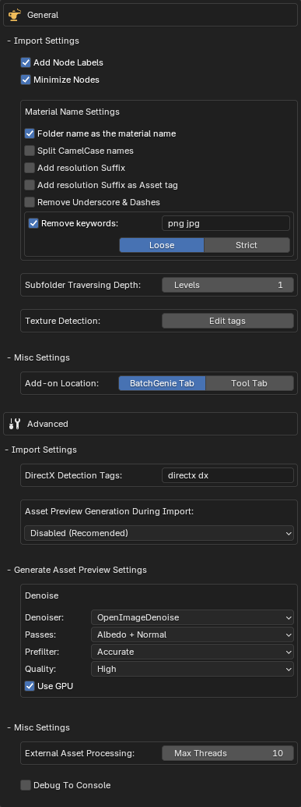
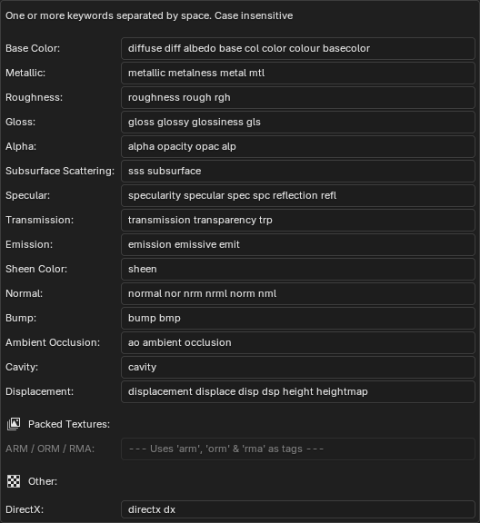

To access BatchGenie's Preferences, click on the :blender_icon_preferences:icon in the BatchGenie panel. Alternatively, you can go to  `Edit > Preferences `, find BatchGenie listed under the Add-ons tab, and click to access its settings for customization.

{ .img-box align=left }

## General

#### Import Settings {#general-import-settings}

  - **Add Node Labels**: Adds labels such as 'Base Color', 'Roughness', etc., to imported texture nodes. If not enabled, the file names will be used as labels.

    ??? abstract "Label Example"
        A texture node with a label compared to one without:

        

  - **Minimize Nodes**: Minimizes texture-nodes in the node editor for a cleaner layout.

    ??? abstract "Minimize Example"
        The top texture node is minimized, while the bottom one remains expanded:

        

  - **Material Name Settings**:
    - **Add resolution Suffix**: Automatically appends the texture resolution to the material name, e.g., 'Oak Bark 4K', derived from the Base Color image. Skips adding the suffix if the material name already includes terms like 2K or 4K.
    - **Add resolution Suffix as Asset tag**: Similar to the above, but instead of modifying the material name, it applies the resolution as a tag to the Asset. This works only if 'Mark as Asset' is enabled.
    - **Subfolder name as the material name**: When enabled, the name of the subfolder will be used as the material name for textures found inside that folder. If this option is disabled, the material name will be derived from the texture filenames.
    - **Remove Underscore & Dashes**: Replaces '_' and '-' in the material names with space".
    - **Split CamelCase names**: Splits names such as 'MetalBronzeWorn' into 'Metal Bronze Worn'.

  - **Subfolder Traversing Depth**: Specify how many levels deep to search for subfolders when importing textures. The default depth is set to 1, meaning only one level deep will be searched within the selected folder. Adjust this setting to control the folder depth for more complex directory structures.

  - **Texture Detection**: Edit the tags used for detecting different texture types during import. These tags, which are case-insensitive and separated by spaces, help BatchGenie automatically recognize and categorize textures.

    ??? abstract "Texture Tags"
        { .img-box }

####  Misc Settings {#general-misc-settings}

- **Add-on Location**: Choose whether the add-on appears in its own "BatchGenie" tab in the N-Panel or within the existing Tool Panel. This option can help save tab space if the N-Panel is too crowded and also applies to the BatchGenie tab in the Shader Editor.

---

## Advanced

#### Import Settings {#advanced-import-settings}

  - **DirectX Detection**: Specify keywords to automatically detect DirectX normal maps. If a DirectX normal map is found, a converter node is added to transform it to OpenGL format, which Blender uses. Enter one or more case-insensitive keywords separated by spaces.

    ??? abstract "Normal Map Conversion Example"
        

  - **Asset Preview Generation during Import**: Controls whether Asset Previews are automatically generated during the import process. Options include:
    - **Disabled (Recommended)**: Asset previews are not generated automatically. Use the `Generate Asset Previews` function after import to create previews.
    - **Enabled - Low Quality**: Uses Blender's default Asset generation function for fast, but lower-quality previews.
    - **Enabled - High Quality**: Uses the add-on to create high-quality previews during import. See the `Generate Asset Previews` tab in the add-on panel for settings.

    !!! warning "Note on automatic Asset generation"
        Enabling this feature may significantly increase processing time and affect stability, especially with a large number of textures. It is recommended to keep this setting disabled.

#### Generate Asset Preview Settings {#advanced-generate-Asset-preview-settings}

- **Denoise**: These settings reflect Blender's default options for denoising, including the choice of denoiser method and adjustments for Passes, Prefilter, and Quality. The selected denoiser method determines how images are denoised during Asset Preview rendering with BatchGenie. Enable this feature via the main BatchGenie panel under `Render Settings` to apply the chosen denoising method.

    !!! info2 "Which Denoiser should I choose?"
        While **OptiX** excels in performance on Nvidia GPUs, **OpenImageDenoise** stands out for its adaptability across various hardware setups and is often favored for delivering better results. For further details see [this section](https://docs.blender.org/manual/en/latest/render/cycles/render_settings/sampling.html#denoising){ target="_blank" } in the Blender manual.

####  Misc Settings {#advanced-misc-settings}

- **External Asset Processing Max Threads**: Controls the number of parallel processes used when handling external Assets via the Asset Browser utilities. Specifically, it determines how many Blender processes run in the background when adding tags or metadata to Assets located outside the current blend file. Adjust this setting based on your system's capabilities to achieve optimal performance when processing external Assets.  Note that "Max Threads" does not apply to rendering Assets. The rendering process itself is the primary bottleneck, rather than the integration of rendered images with Assets.

- **Debug To Console**: Outputs debug information to the console, useful for troubleshooting. To view the console, go to `Window > Toggle System Console`.