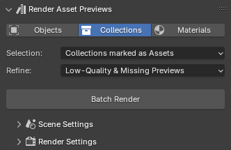
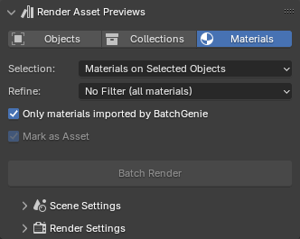
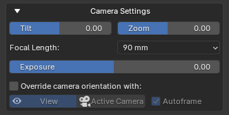

---
tags:
  - HDRi
---
When it comes to rendering Asset Preview images, you have two distinct options. You can either utilize Batch Rendering through the BatchGenie panel, or selectively choose Assets from the Asset Browser for which you wish to render previews for. BatchGenie supports rendering previews for materials, collections, and objects, including VDB volumes.

When rendering via the Asset Browser, you can work with both internal and external Assets, so you don't have to open each individual Asset Blend file separately.

## Batch Rendering

{ .img-box align=right }

1. Open the BatchGenie panel.
2. Go to the `Render Asset Previews` section in the panel.
3. Choose the Asset type you want to render previews for and select the appropriate filters to target the Assets that need previews.
4. Configure the scene and render settings as needed.
5. Click `Batch Render`, and BatchGenie will render all Assets that fit your selection filter.

## Rendering via Asset Browser

1. Open the Asset Browser.
2. Select the Assets you want to render.
3. Locate the BatchGenie menu.
4. Configure the scene and render settings as needed.
5. Click on `Render selected Assets` and BatchGenie will render all selected Assets.

{ .img-box }

## Settings

You can access the settings through both the BatchGenie panel and the BatchGenie menu in the Asset Browser.

#### Asset Selection

=== "Objects"
    { .img-box align=left }

    - **Selection**: Allows you to specify which objects to include in the rendering process based on predefined criteria. Options listed below:
        - **Selected Objects**: Choose the currently selected object(s) in your scene. When using this option, you have the option to mark the objects as Assets.
        - **Objects marked as Assets**: Objects in the your file that are marked as Assets.

    

    - **Refine**: Helps you to refine the selection made with the 'Selection' function by applying additional criteria.
        - **Missing Previews**: Selects objects that are missing Asset Previews.
        - **Low-Quality Previews**: Selects objects with existing Asset Previews below 256px in resolution.
        - **Low-Quality & Missing Previews**: Selects objects with existing Asset Previews below 256px in resolution, as well as objects without Asset Previews.
        - **No Filter (all objects)**: Selects all objects that match the previous selection without any further filtering.

    - **Mark as Asset**: Marks the objects as Assets. This option is shown depending on the 'Selection' option. This option can only be disabled if you are saving previews externally (see [Render Settings](#render-settings)).

=== "Collections"
    { .img-box align=left }

    - **Selection**: Allows you to specify which collections to include in the rendering process based on predefined criteria. Options listed below:
        - **Selected Collection**: Choose the currently selected collection in your scene. When using this option, you have the option to mark the collection as an Asset.
        - **Collections marked as Assets**: Objects in the your file that are marked as Assets.

    

    - **Refine**: Helps you to refine the selection made with the 'Selection' function by applying additional criteria.
        - **Missing Previews**: Selects collections that are missing Asset Previews.
        - **Low-Quality Previews**: Selects collections with existing Asset Previews below 256px in resolution.
        - **Low-Quality & Missing Previews**: Selects collections with existing Asset Previews below 256px in resolution, as well as collections without Asset Previews.
        - **No Filter (all objects)**: Selects all collections that match the previous selection without any further filtering.

    - **Mark as Asset**: Marks the collections as Assets. This option is shown depending on the 'Selection' option. This option can only be disabled if you are saving previews externally (see [Render Settings](#render-settings)).

=== "Materials"
    { .img-box align=left }

    - **Selection**:  Allows you to specify which materials to include in the rendering process based on predefined criteria. Options listed below:
        - **Materials on Selected Objects**: All materials assigned to the the currently selected object(s) in your scene. When using this option, you have the option to mark the materials as Assets.
        - **Materials marked as Assets**: Materials in your file that are marked as Assets.
        - **All materials**: All materials in your file regardless if they are marked as Assets or not. When using this option, you have the option to mark the materials as Assets.

    

    - **Refine**: Helps you to refine the selection made with the 'Selection' function by applying additional criteria.
        - **Missing Previews**: Selects materials that are missing Asset Previews.
        - **Low-Quality Previews**: Selects materials with existing Asset Previews below 256px in resolution.
        - **Low-Quality & Missing Previews**: Selects materials with existing Asset Previews below 256px in resolution, as well as materials without Asset Previews.
        - **No Filter (all materials)**: Selects all materials that match the previous selection without any further filtering.

    - **Only materials imported by BatchGenie**:  When enabled, this option ensures that the batch operation only affect materials imported by BatchGenie. Disabling it applies changes to all materials in your file, regardless of their origin.
    - **Mark as Asset**: Marks the materials as Assets. This option is shown depending on the 'Selection' option. This option can only be disabled if you are saving previews externally (see [Render Settings](#render-settings)).

---

#### Scene Settings

{ .img-box align=left }

- **Light Preset**: Choose from a selection of different lighting presets to enhance your renders. Options include various sky setups as well as Blender's built-in HDRIs. There is also a 'Custom World' option that utilizes your scene's current 'World' for lighting, allowing you to use your own HDR images.

    ??? abstract "Light Presets Example"
        This popup is shown when clicking on the Light Preset icon.

        { .img-box .on-glb }

- **Studio Preset**: Allows you to add a studio backdrop as a background if desired. The backdrop automatically scales to fit the object you are rendering, ensuring that the background matches your asset's size and position.

    *Note: Studio Presets are not recommended to be used when rendering VDB volumes. The placement of VDB volumes within the studio backdrop can be finicky and may not always work as planned.*

    ??? abstract "Studio Presets Example"
        This popup is shown when clicking on the Studio Preset icon.

        { .img-box .on-glb }

    ??? info2 "Studio Settings"
        When you select a Studio Preset, the following settings are available:

        { .img-box align=left }

        

        - **Material**: Choose from the built-in materials, which include some basic options with adjustable settings, or use your own material.
        - **Transparent Backdrop**: *(Cycles Only)* Makes the studio backdrop see-through while remaining visible in reflections and bouncing back light to the objects.
        - **Backdrop passes light**: Enables the backdrop to allow light to pass through it, preventing it from blocking light from world lights.

        - **Object Z Offset**: Allows you to adjust the object's height after its lowest point has been aligned with the ground. Use a positive value to lift the object above the ground or a negative value to lower it further.

- **Transparent Background**: Enables a transparent background in rendered images by toggling the 'Render > Film > Transparent' option for the render scene.
- **Strength**: Adjusts the light strength of the world background.
- **Saturation**: Adjusts the saturation of the world background. This setting is useful when you want to use an HDR image for lighting your scene but don't want the colors of the HDR to influence the colors in your final render. By adjusting the saturation, you can desaturate the HDR image, allowing you to retain the lighting effects without the HDR's color affecting your scene's appearance.

- **Rotation**:
    - **Sun Rotation**: Adjusts the horizontal angle of the sunlight in your scene or rotates the HDRI background for lighting. This changes the direction from which light illuminates objects.
    - **Object Rotation**: Adjusts the rotation of the object.
    - **Camera Rotation**: Adjusts the rotation of the camera. Useful when you want to keep the lights & shadows in their current position but want to change the framing.

    !!! tip "Tip"
        You can also use the icon buttons to the left and right of the slider to adjust them in -/+ 45 degree increments.

??? info2 "Camera Settings"
    { .img-box align=left }

    - **Vertical Angle**: Adjusts the vertical angle of the camera, moving it up or down to change the perspective from which the scene is viewed, either looking up or down.

        ??? abstract "Vertical Angle Example"
            { .img-box }

    - **Zoom**: Adjust the camera distance from the object. Zoom in for a close-up view or zoom out to add space around your object.
    - **Focal Length**: Adjusts the focal length of the camera, affecting the field of view and perspective. A shorter focal length increases the field of view, creating a wide-angle effect, while a longer focal length decreases the field of view, producing a zoomed-in effect.

    

    - **Exposure**:  Adjusts the overall brightness of your scene by controlling the amount of light that reaches the camera, effectively brightening or darkening the rendered image.

        ??? abstract "Exposure Example"
            { .img-box }

    - **Override camera orientation with**: Lets you use a custom camera angle. Choose between:

        - **View**: Set the render camera to match the current 3D view's perspective, ensuring the render viewpoint aligns with the 3D viewport
        - **Active Camera**: Set the render camera to the position and orientation of the active camera, ensuring the render viewpoint matches the current active camera's view.

        **Autoframe**: When using the override, the **Autoframe** option automatically adjusts the camera to frame the selected object perfectly, ensuring that it fits within the view without any clipping. Disable this option for manual framing of your Asset, such as for close-up shots.

        *Note: Autoframe cannot be disabled when rendering materials. However, you can still render selected Assets, and Autoframe will be disabled for all other elements except materials.*

- **Material Preview Object**:

    These settings are used when rendering material Assets.

    - **Preview Object**: Select the model type used to display the material preview. Choose from options Sphere, Suzanne, Cylinder, or Custom. The Custom option allows you to use the currently selected object in your scene as the preview model.
    - **Clear current materials**: When rendering previews using the 'Custom Object' option, enable this setting to show only the previewed material on the object. Disable to retain existing materials on the object, assigning the preview material to slot 1. Useful for objects with multiple materials.
    - **Subdiv**: The number of subdivisions to apply to the model.
    - **Adaptive Subdiv**: *(Cycles Only)* Dynamically adjusts the level of detail for subdivided surfaces based on the camera distance, optimizing render times while maintaining high-quality details where needed. Useful for materials with displacement.

---

#### Render Settings

{ .img-box align=left }

Here, you'll find settings for the render engine, aspect ratio, resolution, and other Blender default render settings you're likely already familiar with.

!!! tip "Tip for Asset Preview Resolution"
    When rendering images to use as previews for the Assets themselves, the previews saved inside the Asset are limited to 256x256 pixels. With that said, the recommended render resolution is 512x512, which improves overall sharpness even if saved at a lower resolution afterward. This offers an improvement over Blender's default Asset Preview resolution of 128x128 pixels.

- **Output**: Determines where your rendered images are saved. You can choose between:
    - **Save in Asset**: to save images within the Blender file.
    - **Save in Asset & Save Externally**: to save both within the file and as separate external files.
    - **Save Only External**: to save images only as external files.

!!! info2 "More render settings"
    These render settings are copied from your current scene, and you can edit them by going to the `Render` tab in the Properties panel to make your desired changes.

    **Cycles:**

    - **Light Paths**: All settings.
    - **Volumes**: `Step Rate Render` & `Max Steps`.
    - **Subdivsion**: `Dicing Rate Render`.

    **EEVEE:**

    - **Shadows**: All settings are copied except for enabling or disabling, which is controlled within the BatchGenie Render Settings. Also the `World > Settings > Sun` settings are copied except for enabling or disabling the shadow, which is also controlled within the BatchGenie Render Settings.
    - **Raytracing**: All settings are copied except for enabling or disabling, which is controlled within the BatchGenie Render Settings.
    - **Volumes**: All settings.
    - **Performance**: `High Quality Normals`.

    **Shared Settings**:

    - **Color Management**: `View Transform` & `Look`.

## FAQ

`Can I add custom Light Presets?`

:   Yes! The list can be expanded by directly adding your own HDRIs to Blender via `Preferences > Lights > HDRI's` which makes them available in this list.

`I'm having slow rendering speeds in Cycles. What can I do?`

:   Besides adjusting the sample settings under the render settings in the BatchGenie panel, consider tweaking the following settings in Blender’s default `Render` tab in the Properties panel. These settings are copied from your scene when rendering:

    - Decrease the light paths under `Render > Light Paths`.
    - For volumes/VDB rendering, check `Render > Volumes` and adjust the `Step Rate Render` and `Max Steps`. Increasing the `Step Rate Render` can significantly speed up renders. For Asset Previews, setting `Step Rate Render` to 5 or higher can halve render times compared to the default 1, without losing visible detail at that scale. If you're rendering for external use, you may need to balance the minor loss in detail against the improved speed.
    - If using **Adaptive Subdivision** for models, adjust the `Dicing Rate Render` in your scene. Ensure the "Experimental" Feature Set is enabled under `Render > Feature Set`. Then, increase the `Dicing Rate Render` value under `Render > Subdivision`.

`I'm experiencing unusual behavior with object location when using the Studio Setups. What should I do?`

:   Try applying the Scale and Rotation transformations to your object(s). This should resolve the issue.

## More adjustments in Preferences {#more-settings data-search-exclude}

See the add-on [Preferences](preferences.md) for more settings related to rendering.